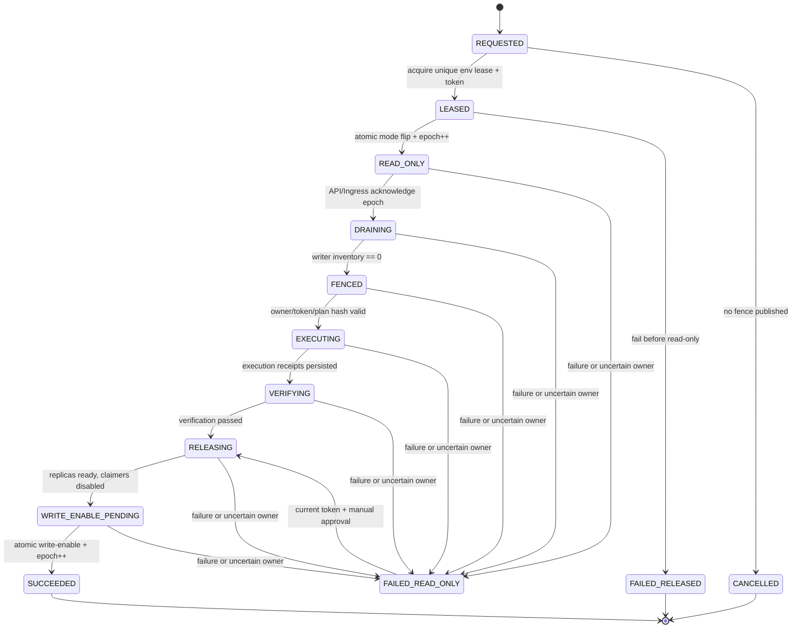

# ADR-0003：平台维护状态机、租约、fencing 与任务唯一 owner

- 状态：已接受
- 决策日期：2026-08-28
- 实施任务：DR0-03
- 前置决策：[`ADR-0001`](ADR-0001-platform-state-boundaries-and-recovery-objectives.md)
- 机器可读合同：[`platform-maintenance-ownership.yaml`](platform-maintenance-ownership.yaml)
- 可执行参考：`hc_data_platform.platform_control.maintenance_contract`
- 持久化实施：SYS1-03 已通过本地 PostgreSQL 和三节点 Kubernetes 断连/接管/恢复验收；尚未生产部署，逐 release 仍须复验
- 取代方式：只能由新 ADR 显式取代；新增异步任务必须先加入 ownership contract

## 背景

平台已经同时使用 Temporal、PostgreSQL Outbox、Helm migration Job、PostgreSQL advisory lock，以及 aligned-media/Outbox 的 owner-token lease。这些机制解决不同问题，但如果把 launcher、dispatcher、容量 slot 或 activity lease 误当成第二个业务 scheduler，多副本环境会产生重复 owner、旧进程复活写入或维护期间漏写。

ADR-0001 要求冷一致性备份先进入只读、停止新任务、等待 writer 清零，且 ownership 不确定时保持只读。本决策冻结该维护状态机、数据库时钟租约、单调 fencing token、writer permit/inventory 和每类任务的唯一协调权威。SYS1-03 已实现持久化表、middleware、Worker/Outbox/storage hooks，并通过本地 PostgreSQL 并发与三节点 Kubernetes disconnect/reconnect 验收。

## 术语

- **协调权威（coordination authority）**：唯一决定某个逻辑任务何时开始、重试、结束和去重的系统；每个 task class 只能有一个。
- **launcher**：创建进程/Pod/Job，但不决定业务任务身份；可以安全重复启动。
- **dispatcher**：把持久事件投递到协调权威，不执行领域业务步骤。
- **execution fence/activity lease**：保护一次执行尝试或资源，不创建第二个任务队列。
- **capacity fence**：限制 FFmpeg 等资源并发，不拥有 ingest workflow。
- **writer permit**：在一个环境 fencing epoch 下、带过期时间的提交许可；数据库提交前必须再次校验。

## 决策

### 1. 唯一任务 owner

每个 task class 固定一个协调权威：

| Task class                                            | 唯一协调权威            | 其他机制只允许的角色                                                                  |
| ----------------------------------------------------- | ----------------------- | ------------------------------------------------------------------------------------- |
| Ingest rollout（含 aligned MP4）、Annotation review | Temporal workflow       | Outbox 仅 dispatch；PostgreSQL attempt/capacity lease 仅 fence activity               |
| Outbox → Temporal 投递                                | Outbox dispatcher       | Temporal 是带确定 workflow ID 的去重 destination，不反向 claim Outbox                 |
| Helm schema migration                                 | Kubernetes Job          | PostgreSQL advisory lock 是 execution fence；Helm controller 是 launcher              |
| 离线 restore execute                                  | 唯一命名 Kubernetes Job | 外部 CLI 是 command executor；platform maintenance operation 是 target mutation fence |
| 平台维护/备份协调、aligned-media orphan reconciliation、Storage inventory | Database lease | Worker/Job/CLI 只 launcher 或 executor，不再注册 Temporal schedule/Outbox consumer |

`platform-maintenance-ownership.yaml` 是精确 task registry。一个 task 不能同时声明 Temporal 和数据库 scheduler，不能让 Outbox worker执行领域步骤，也不能让同一 Kubernetes Job 与 Temporal workflow 竞争同一逻辑任务。

当前实现边界和剩余验收如下：

- `IngestRolloutWorkflow`（含全部相机 MP4）和 `AnnotationReviewWorkflow` 已由 Temporal 承载；
- `security/outbox.py` 已用 claim token/lease 投递确定的 workflow ID；
- Helm migration Job 已调用带 PostgreSQL advisory lock 和 checksum ledger 的迁移器；
- aligned-media attempt/publication/capacity lease 已是 activity/resource fence，不是第二个 scheduler；
- Storage inventory 与 aligned-media 维护循环的写入现已取得、续租并在提交前复核 `maintenance_controller` writer permit；storage inventory 还按精确 scope 取得数据库权威 singleton task lease，接管会替换 lease UUID 并在提交事务内复核。三节点 Kubernetes 验收中，owner A 断开 PostgreSQL 后 owner B 在另一节点接管，A 恢复后的续租与提交均以 `PLATFORM_TASK_LEASE_STALE` 拒绝，且没有重复副作用。

### 2. 维护操作状态机



同一 `environment_id` 只能有一个 nonterminal operation。`REQUESTED` 还没有写权限；取得 lease 后由 PostgreSQL 单调序列分配永不复用的 `fencing_token`。从 `LEASED` 到 `READ_ONLY` 的事务同时把 environment mode 改为 `READ_ONLY_MAINTENANCE` 并推进全局 epoch，因此旧 writer permit 立即失效。

任何进入 `READ_ONLY` 后的失败、超时、owner 不明或 affected-row 不等于 1 都进入 `FAILED_READ_ONLY`，不得自动恢复写入。只有持有当前更高 token 的 owner 和显式 manual approval 才能重新进入 `RELEASING`。

解除写入不能分成“先开 API、后写成功状态”两步。`WRITE_ENABLE_PENDING -> SUCCEEDED` 必须在一个数据库事务中：确认 writer inventory 为零和 reconciliation/审批通过，推进 epoch，切换 `READ_WRITE`，写 terminal state 和追加审计事实。新 writer 之后才可取得新 epoch permit。

### 3. Lease、续租与接管

所有 lease 判断使用 PostgreSQL database clock，不使用 Pod wall clock。建议合同是 30 秒 lease、10 秒续租；具体值只能在保持 `renewal < lease / 2` 的新 ADR/contract version 中修改。

每次状态 mutation 的 SQL predicate 必须同时匹配：

```text
operation_id + environment_id + owner_instance_id + fencing_token
+ lease_until > database_clock
+ expected_state + expected_state_version
```

且 affected rows 必须为 1。续租、完成、失败和 checkpoint 都遵循同一 predicate。只在 database clock 确认 lease 过期后允许 takeover；takeover 保留 operation/state，换 owner，并从数据库序列取得严格更大的 token。旧 owner 即使网络恢复也只能收到 `PLATFORM_MAINTENANCE_FENCING_TOKEN_STALE`，不能续租、改变状态或提交业务写。

### 4. Writer permit 与 drain inventory

所有可能把新业务事实提交到 PostgreSQL 或创建可被数据库引用的对象的路径都必须取得 permit：API command、预签名上传 grant、Outbox claim、Temporal activity、aligned-media attempt、maintenance controller 和 Kubernetes Job。提交时校验 environment、当前 mode、精确 epoch token 和数据库时钟下的 permit expiry；只在请求开始时校验不够。

进入 `READ_ONLY` 后：

1. API/Ingress 对所有 command 和新预签名授权返回 HTTP 503 + `PLATFORM_MAINTENANCE`；read-only query 保留。
2. 停止新 Outbox claim 和平台 DB-lease task claim；已持有旧 epoch 的提交被拒绝并安全重试。
3. 暂停 Temporal schedules；workflow 按领域 policy 完成只读步骤、等待、取消或记录待 reconciliation，不创建无 permit 的业务写。
4. 等待 aligned-media attempt/publication lease、multipart/upload grant、Kubernetes Job 和数据库 transaction 完成、过期或被精确撤销。
5. writer inventory 对机器合同中的每个来源都有零值；未知 writer 等同失败。

只有 inventory 全零才能进入 `FENCED`。把 Worker replica 缩容到零只是证据的一部分，不能替代数据库 permit/lease inventory；心跳列表也不能作为唯一一致性依据。

### 5. 各机制的维护行为

**Temporal**：生产仍使用 ADR-0001 的 external managed namespace。Temporal 是领域 workflow owner；维护 controller 只 pause/resume schedule 和记录 open workflow inventory，不复制 workflow 状态到数据库队列。恢复时按确定 workflow ID reconciliation。

**Outbox**：Outbox 唯一拥有“持久事件到 Temporal start/signal”的投递任务。维护期间停止 claim；claim token/lease 只保护一次 dispatch。Temporal workflow 成功不允许反向把 Outbox 当作业务执行 owner，Outbox handler 也不运行领域 pipeline。

**Kubernetes Job**：Helm migration 和离线 restore 使用 operation/release 派生的精确 Job identity。Job 是这些离线执行的 owner；Helm/CLI 只是 launcher/command source。迁移 advisory lock 或 restore target fence 是执行保护，不是第二个 scheduler。Job 重建必须消费相同 operation checkpoint，不能生成新逻辑任务。

**Database lease**：仅用于 platform maintenance、per-item GC、storage inventory 等平台任务，及 activity/resource fencing。Database lease 不承载已有 Temporal workflow 的 retry graph。定时 Worker 副本可以都运行 launcher loop，但只有一个持有 task/scope lease 的副本执行。

### 6. 安全、审计和稳定错误

- owner 使用不可复用 `instance_id`，不使用 hostname；fencing token、claim token、operation ID 不是认证凭据。
- acquire/takeover、每次 state transition、失败、manual approval 和 write enable 都追加 P19 审计事实，不覆盖历史。
- 普通 platform admin 可读脱敏状态；backup/release operator 才能发 command；失败恢复需要独立 approver。浏览器不持有 cluster-admin 或 break-glass credential。
- 错误至少区分 `PLATFORM_MAINTENANCE`、`PLATFORM_MAINTENANCE_OWNER_MISMATCH`、`PLATFORM_MAINTENANCE_FENCING_TOKEN_STALE`、`PLATFORM_MAINTENANCE_LEASE_EXPIRED` 和 `PLATFORM_MAINTENANCE_STATE_CONFLICT`，详情不得泄露 owner credential 或业务 payload。

## 可执行合同与验收

DR0-03 的合同测试必须证明：

1. 每个已登记 task class 恰有一个 coordination authority，其他三种 authority 明确禁止并只可作为限定 supporting role；
2. Temporal、Outbox、Kubernetes Job 和 database lease 的角色语义互斥，所有 evidence path 存在；
3. owner、token、lease、state/version 任一不符都拒绝 transition；非法跳步拒绝；
4. `FAILED_READ_ONLY` 没有 manual approval 不能释放；
5. read-only mode、旧 epoch、过期 permit 或错 environment 都拒绝 writer commit。

上述设计合同、SYS1-03 PostgreSQL 集成测试与三节点 Kubernetes fault probe 共同证明 database-clock lease、单调 token、提交期 permit/task-lease 复核和旧 owner 拒绝。机器证据为 `backend/tests/system/results/sys1-03-kind-task-lease-summary.json`；本地 Kind 证据不替代生产环境逐 release 复验。

## 后果

- SYS1-02 的 instance identity/heartbeat 是 owner 可观测性输入，但 lease/fencing 仍以 PostgreSQL 为权威。
- SYS1-03 已实现 environment fence、maintenance operation、writer permit/inventory、platform task lease、middleware 和 Worker/Outbox/storage/aligned-media hooks；正式环境使用 PostgreSQL 权威，内存实现仅用于隔离测试。
- 任何新增 CronJob、Temporal schedule、Outbox consumer 或 Worker loop 必须更新 task registry；未登记 owner 阻断发布。
- 真实 KMS/备份库、备份执行和恢复仍分别由 BAK2/RST3/DR7 验证，本 ADR 不扩大完成声明。
