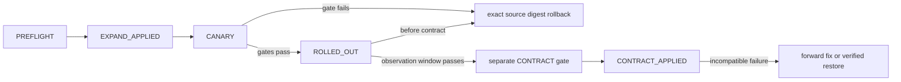

# ADR-0004：相邻版本兼容矩阵与 expand/migrate/contract 发布边界

- 状态：已接受
- 决策日期：2026-08-28
- 实施任务：REL0-01
- 机器可读合同：[`release-compatibility-matrix.yaml`](release-compatibility-matrix.yaml)
- 可执行参考：`hc_data_platform.platform_control.release_contract`
- 发布实施：SYS1-01、REL6；本 ADR 不声称 `0.1.1` 已构建或发布
- 取代方式：只允许新 ADR/contract version；每个新相邻 release edge 必须在 canary 前加入矩阵

## 背景

当前 backend package/runtime、frontend package、Helm Chart/appVersion 都写为 `0.1.0`，但默认 development baseline 仍可为 `unreleased`，且没有可发布的签名 release manifest。数据库有 109 个 forward-only、checksum-bound migration；OpenAPI 有前一 aggregate → 当前 aggregate 的兼容检查和生成 client drift gate；Temporal workflow 使用 8 个 `workflow.patched()` ID，当前实现已按不可变 release build ID 为两条固定 task queue 安装 compatible-default routing，但真实 target build 与 production Temporal server version 仍须逐 release 验证。

这些是升级骨架，不是安全滚动发布。单纯 Helm rollback 只能回滚应用模板；它不能撤销数据库 DDL、重写 Temporal history、让新 frontend 自动兼容旧 API，或证明旧 Worker 能 replay 新 history。本决策冻结每条相邻 release edge 必须明确的双向兼容和不可逆边界。

## 决策

### 1. Release identity 与矩阵

一个可发布 identity 必须同时固定：semantic version、release ID、Git commit、Chart version、frontend/API/main Worker/media Worker 镜像 digest、migration manifest/hash、OpenAPI hash、Temporal patch set 和 build/deployment identity、配置 contract hash、SBOM/provenance/signature。任一组件仍是 `unreleased`、tag 而非 digest、hash 漂移或签名缺失时，edge 不能进入 `READY_FOR_CANARY`。

`release-compatibility-matrix.yaml` 记录：

- 当前 development baseline 的可重现 fingerprint 和未闭环阻断；
- 每个 source → target 相邻 edge 的 DB、Temporal、API/client、config 和 rollback 双向结果；
- 全局 expand/migrate/contract、deprecation、Worker routing 和 rollback 规则。

矩阵中的 `0.1.0 -> 0.1.1-contract-only` 是**设计 edge**：它冻结“下一 patch 若不改变 schema/workflow/API/config 时”的精确 identity boundary，用来证明矩阵结构和 fail-closed 规则。`0.1.1` artifact 尚未构建/签名，production Temporal version、Worker routing、容量和 DR evidence 都缺失，因此状态固定为 `DESIGN_ONLY_TARGET_ARTIFACTS_NOT_BUILT`，不是发布计划已获批。真实 target 只要改变任一 fingerprint，就必须更新 edge 和重新验证，不能沿用 identity PASS。

### 2. 发布阶段

阶段约束：

1. **Preflight**：验证 release signature/digest/SBOM、matrix edge、依赖版本、无 active maintenance、容量、最近 `INTEGRITY_VERIFIED` backup 和有效 `RESTORE_VERIFIED` drill。
2. **Expand**：单一 migration owner 在 advisory lock 下只执行兼容增加；source 和 target 应用同时在 expanded schema 上测试。
3. **Migrate**：大表/对象语义变更使用 checkpoint、幂等、限速批处理；双版本 read/write path 仍有效。
4. **Canary/Rollout**：API、frontend、main Worker、media Worker 分开 canary；同时验证两版应用、API/client 两个方向、Temporal history routing、Outbox、审计和对象写链。
5. **Contract**：稳定观察和 rollback window 后的独立 release gate。删除旧字段/索引/配置/Secret key、收紧约束和移除旧 workflow/API path 只能在此阶段。

Contract 不是常规 upgrade hook 的尾部命令，不能在同一 Helm transaction 中随 target rollout 自动执行。

### 3. PostgreSQL expand/migrate/contract

**Expand 可做**：新增 nullable column、带 source-safe default 的 column、新表、保留旧访问路径的新 index、经过 unknown-enum reader 测试的 enum value、dual-read/dual-write 辅助结构。

**Expand 禁止**：drop/rename、未 backfill 就 NOT NULL/narrow type、删除 enum value、改变现有字段语义、让新 config/Secret 成为 source app 启动必需项。所有 migration 继续 append-only；已经记录 checksum 的文件永不修改。

**Migrate** 必须可暂停/重试，有稳定 checkpoint 和 no-progress fail closed；不能让 target 写出 source 无法读取的唯一格式，除非 source 已退出且 contract gate 已批准。

**Contract 前置**：确认没有 source release Pod、Job、Temporal task/build 或长事务；观察期结束；target 稳定；最新 backup 和 restore drill 满足 policy；显式审批。数据库没有 down migration。Contract 后若 source app 不兼容 forward schema，常规应用 rollback 被禁止，只能 forward fix 或从已验证 backup 做受控 restore。

### 4. Temporal workflow 兼容

Temporal history 是外部持久事实，应用镜像 rollback 不会回滚 history。每条 edge 必须记录 source/target patch ID 集合和三项证据：existing history replay、source worker replay target history、target worker replay source history。

规则：

- patch ID 全局不可复用或改变语义；新增 patch 要先让旧 history replay 通过；
- 移除 patch call 前必须完成 Temporal 支持的 deprecation/removal 生命周期，并证明保留 history 不再需要旧分支；
- source Worker build 保留到 rollback window 结束；target task 只能按受信 Worker Build ID/deployment routing 送到兼容 build；
- 未知/unrouted history、nondeterminism 或 production Temporal server version 未在 release manifest 明确时停止 rollout。

当前 staging/production Worker 从 release identity 派生 Build ID，release controller 可为 main/media 两条 task queue 安装 target compatible-default routing，并保留 source build 到 rollback window 结束；未知或未路由 history 仍停止 rollout。local/test namespace 默认不启用 routing，只有显式 `HC_TEMPORAL_WORKER_BUILD_ID` 才用于定向协议测试，避免把未启用 versioning 的开发 namespace 冒充托管发布环境。该实现不等于真实相邻 target history replay 已通过。Compose `temporalio/auto-setup:1.25.2` 只是 development evidence，不能填入 production support claim；每条 release edge 仍必须记录 production server version 与三类 replay 证据。

### 5. API、frontend 与生成 client

滚动/canary 必须同时证明：

1. source frontend/generated client → target API；
2. target frontend/generated client → source API（canary 混部和应用 rollback 所需）。

现有 OpenAPI previous → current gate只覆盖第一类 server backward compatibility，不能替代第二类真实 target-client/source-server 测试。删除 operation、required response field、enum value或收紧 request 都是 incompatible；必须使用新 versioned path/dual contract，并至少保留两个相邻 releases 的 deprecation window。生成 client 必须与 target OpenAPI 精确匹配，手写类型不能掩盖 drift。

### 6. 配置与 Secret 兼容

Expand 新增 config 必须有 source-safe default，source app 在 target ConfigMap/Secret 集合下可启动；target app 在 source config 下也必须给出稳定预检错误或兼容 default。删除/重命名 config 或 Secret key 是 contract change，必须等 source 实例退出和 rollback window 结束。

默认禁止热加载。只有 allowlist 内、有 schema、revision、P19 audit、失败回滚和多副本一致性证据的 key 才能热加载；其他值通过新 release 滚动。HA4-05 当前只允许 aligned-media maintenance 周期、storage inventory 周期和 maintenance banner 开关；DSN、Secret、credential、TLS、镜像和 schema/migration identity 仍必须通过新 release 与进程重启。

### 7. Rollback 边界

- **Preflight**：未变更系统，无需 rollback。
- **Expand/Canary/Rolled out、尚未 Contract**：只有 source app 对 target expanded schema、source Worker 对 target history、target frontend 对 source API、source app 对 target config 全部 PASS，才允许部署矩阵记录的精确 source digests；数据库保持 forward schema，不执行 down migration。
- **Contract 后**：若 matrix 明确 source 仍兼容，可回滚应用并保留 schema；否则 fail closed，执行 forward fix 或已验证 restore。不能把 `helm rollback` 成功当成数据库/Temporal rollback 成功。
- rollback 仍须保留审计、operation ID、canary stop reason 和当前 backup/recovery boundary。

`evaluate_rollback()` 是无副作用 reference：它在确切 phase 和 edge 证据上返回唯一安全动作；edge 没有 contract migration 却声称 `CONTRACT_APPLIED`、或兼容证据不全时拒绝/阻断。

## 强制 matrix gate

`READY_FOR_CANARY` 或 `RELEASED` edge 必须：

- target artifacts 已构建、digest 固定且签名；
- DB old-on-new/new-on-old 两方向 PASS；
- Temporal 三类 replay PASS 且 Worker Build ID routing 已启用；
- API/client 和 config 两方向 PASS；
- 没有 release blocker；
- release preflight 另行确认容量、backup/restore、HA 和真实依赖。

model 拒绝未知字段、错误 SemVer direction/type、patch 集合差异、伪造 `no_schema_change`、无 contract migration 的 contract edge，以及带 blocker 却标 ready 的 edge。

## 当前阻断与后果

- SYS1-01 必须消除 `unreleased` 并让 API/frontend/Worker/OTel/Helm 读取同一签名 release identity。
- REL6 已提供签名 feed/preflight、expand/contract、Temporal Build ID routing、API/frontend canary 自动停止、精确 digest 回滚和四眼审批/审计实现；真实 target manifest、双向 old/new 执行与 DR7 签名生产证据仍是逐 release blocker。
- 当前 5 TB/日 + 30%、真实 HA、backup/restore drill、production Temporal version 均未通过，矩阵设计完成不能解除这些 blocker。
- 每次后续 migration/OpenAPI/workflow patch/config contract 变化都会使 baseline fingerprint 或 planned identity edge drift；必须显式更新 matrix，而不是关闭检查。
