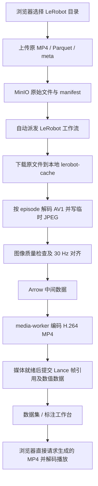

# 数据平台代码、视频链路与迁移审查报告

审查日期：2026-09-20。审查对象：当前工作区，包含已有的未提交修改。

后续修复与上线状态见 [原始存储修复记录](2026-09-20-storage-fixes.md)。本文件保留修复前证据，
其中“当前默认流程”“无运行实例”和未解决项描述不能直接作为修复后的运行状态。

你的目标是：上传 MCAP、LeRobot、ROS bag，保留原始视频与原始数据，方便查询、预览、下载和迁移，避免默认消耗大量 CPU、内存和额外存储。

**结论：现有实现把“原始数据存储”与“生成用于对齐、质检、标注的派生数据”绑定得太紧。最应该改的是上传成功后的默认处理流程，以及预览对派生视频的依赖。单纯删除几个文件或容器不能解决这个问题。**

原文件目前确实会保存；问题是随后还会下载一份本地缓存、抽取 JPEG、质量检查、生成对齐数据，再编码四路 H.264。应调整为：原样保存 → 登记轻量索引 → 原文件可下载、可按能力预览；对齐、质检、标注、兼容转码由用户另行触发。

## 1. 审查范围与证据边界

| 范围 | 本次检查 |
| --- | --- |
| 后端 | 对 `backend/src` 的 305 个 Python 文件建立 AST、导入、定义和文件清单，覆盖 32 个业务/基础模块；重点逐段检查上传、原文件存储、LeRobot、MCAP、工作流、对齐、媒体、Lance、发布导出、API 中间件、数据库访问和清理路径 |
| 前端 | 对 `frontend/src` 的 576 个 TS/TSX 文件建立 AST、依赖及路由可达性清单，另清点 44 个 CSS；重点检查上传队列、四路播放器、播放时钟、数据窗口、API、数据集详情和标注工作台 |
| 部署 | Compose、前后端 Dockerfile、对象存储代理、CI、现有容器与数据卷挂载 |
| 数据 | 检查本机缓存的 G1 LeRobot 数据集元信息、episode 映射及四路 MP4 的实际编码信息 |
| 验证 | 前端全量单元测试、类型检查与构建；后端数据链路相关单元测试、Ruff、OpenAPI 与前端生成客户端检查；导出类型问题的最小复现 |

这是“全量文件盘点和依赖扫描 + 关键执行路径深入审查”，不把自动扫描说成逐行人工读完全部源码。[逐文件清单](2026-09-20-file-inventory.csv)记录了范围，包含测试与生成代码。暂未启动整套平台，未在真实浏览器中录制四路播放性能；因此不能给出当前掉帧中 CPU、网络、解码器各占多少的实测结论。

报告区分三种证据：**已确认**表示代码或本地命令可以直接证明；**性能风险**表示路径存在，但当前用户环境中的影响还需测量；**改进方案**表示尚未实施的目标行为。

## 2. 当前 LeRobot 数据实际怎样流动

核对的数据源是 `unitreerobotics/G1_WBT_Dex1_Put_Clothes_into_Washing_Machine`，本机缓存 revision 为 `6d698e2641cc4bb765cd738835fe3a4ecc0fe2c7`。`meta/info.json` 声明 v3.0、Unitree G1、30 fps、154 个 episode、123603 帧。这些是本机源数据证据，不是本次从已停止的 MinIO 中重新导出的在线数据清单。

对四个 `chunk-000/file-000.mp4` 实测如下；各文件是分片，不能把它们的时长当成整个数据集或单个 episode 的时长。

| 相机 | 编码 / 分辨率 / 帧率 | 分片时长 | 文件大小 |
| --- | --- | ---: | ---: |
| head_stereo_left | AV1 Main / 640×480 / 30 fps | 400.500 s | 203,295,861 B |
| head_stereo_right | AV1 Main / 640×480 / 30 fps | 310.633 s | 205,509,915 B |
| wrist_left | AV1 Main / 640×480 / 30 fps | 426.067 s | 197,909,129 B |
| wrist_right | AV1 Main / 640×480 / 30 fps | 426.067 s | 200,000,508 B |

四路源视频的 time base 都是 `1/15360`。[ffprobe 记录](2026-09-20-source-video.json)。episode 0 为 958 帧，约 31.933 s；episode 1 从约 31.933 s 开始。原视频直读必须保留每个 episode 在视频分片内的偏移，不能把每个 episode 都从文件 0 秒开始播放。

这里有三个容易混淆的事实：

- **上传后存在 AV1 → JPEG → H.264 的转换。**JPEG 是中间产物，原 AV1 文件仍保存在原始数据区。
- **目前 Lance 保存的视频值是帧引用，不是永久保存的一整套 JPEG。**正常退出时临时 JPEG 由临时目录上下文清理；但额外的 H.264 是持久派生产物，本地原文件缓存也会占空间。
- **打开当前播放器，不会因此重新启动这条编码链。**页面播放的是已生成 MP4，浏览器仍需正常解码。不能把“播放时解码”与“后端重新编码视频”混为一谈。

依据：[原视频抽帧](../../backend/src/hc_data_platform/tools/hf_unitree_g1_to_mcap.py#L630)、[原生 LeRobot 适配器](../../backend/src/hc_data_platform/lerobot_imports/adapter.py#L223)、[工作流媒体阶段](../../backend/src/hc_data_platform/workflow/temporal_workflows.py#L433)、[Lance 帧引用转换](../../backend/src/hc_data_platform/runtime.py#L341)、[帧引用模型](../../backend/src/hc_data_platform/aligned_media/models.py#L297)。原生 LeRobot 路径复用了转换工具中的读取函数，但不等于先把数据转换成 MCAP。

其他格式的当前路径：

| 格式 | 当前保存/处理路径 | 与轻量存储目标的差距 |
| --- | --- | --- |
| MCAP | 原文件上传与校验 → 本地临时文件 → 验证、QC 和对齐扫描 → 相机派生 H.264 → Lance / 工作台 | 本地下载采用分块，正常退出删除临时文件；但仍默认进行多轮解析与媒体加工，并非只建立文件/消息索引 |
| 连续录制 capture bundle | 保存配置、传感器和 MP4 资产 → 工作流按时间切片/对齐 → 媒体产物与索引 | 已有 MP4 输入路径，但受 canonical 媒体要求约束，不能保证原视频直接复用 |
| ROS bag | 没有独立上传/解析适配链 | 需要先补原样存储，再按 bag 类型补索引与预览能力 |

MCAP 依据：[统一处理 activity](../../backend/src/hc_data_platform/workflow/activities.py#L776)、[本地文件生命周期与扫描](../../backend/src/hc_data_platform/workflow/ingest_plan.py#L806)。这些地方已经采用流式复制与迭代读取，不能笼统说所有上传都会把整个文件装入内存。

## 3. 不合理、需要优先改的部分

优先级按你的目标排列：P1 为轻量存储和迁移前应解决；P2 为规模增长或体验改进；P3 为维护整理。这里的 P1 不表示已经发生数据丢失。

### A01 · P1 · 原始文件存储被强制处理链绑定【已确认】

`IngestRolloutWorkflow` 先等待所有相机派生 MP4 就绪，检查固定 30 fps、固定 `1/30` PTS 和帧数，再提交 Lance。原始文件虽然已保存，正常浏览与后续业务却仍依赖对齐、质检、编码链完成。

**影响：**一次普通上传承担训练数据加工的成本；编码错误、处理队列拥堵会影响可用性。四路视频变成额外四路编码任务。

**改法：**原文件提交成功即进入 `RAW_COMMITTED`；元信息索引独立为 `INDEX_PENDING/READY/FAILED`；预览、质检、对齐、标注分别拥有独立任务状态。处理失败不应阻止下载原文件。保留原始时间戳和源帧引用，对齐视图按需生成。

依据：[工作流](../../backend/src/hc_data_platform/workflow/temporal_workflows.py#L433)、[LeRobot 调度](../../backend/src/hc_data_platform/workflow/lerobot_workflow.py#L120)。当前每个 import 内已经顺序处理 episode，并非 154 个 episode 一次全部并发；但顺序执行不会消除不必要加工的总成本。

### A02 · P1 · JPEG 往返转换没有必要作为默认路径【已确认】

适配器先通过 FFmpeg 写出 `frame_%06d.jpg`，QC 再读取并解码图像，对齐路径继续读取图像，媒体编码器再从图像生成 H.264。JPEG 本身也是有损中间格式。

**改法：**对已有 MP4 保存文件引用、codec、分片位置、时间范围、原 time base 和 episode 偏移。兼容浏览器的源视频直接读；确实需要兼容版时，单独执行原视频 → 目标视频的任务，并设定并发、线程和缓存上限。图像质量检查改成可选抽样任务，避免默认逐帧解码。

只把 JPEG 环节换成“上传后强制 AV1 → H.264”仍不满足你的资源目标。默认应取消转码，保留显式按需转换的能力。

依据：[抽帧](../../backend/src/hc_data_platform/tools/hf_unitree_g1_to_mcap.py#L630)、[QC 读取](../../backend/src/hc_data_platform/lerobot_imports/adapter.py#L103)、[对齐图像读取](../../backend/src/hc_data_platform/lerobot_imports/pipeline.py#L550)、[媒体编码器](../../backend/src/hc_data_platform/aligned_media/encoder.py#L394)。

### A03 · P1 · “通用 LeRobot 上传”实际限定 G1 模板【已确认】

验证器要求 v3.0、`robot_type=unitree_g1`、固定关节字段和固定四路相机。上传前又要求 ACTIVE 采集任务、启用的机器人数据源和已发布 G1 标注规则。

**影响：**其他机器人的合法 LeRobot 数据、只想存档而不标注的用户，不能按“上传原始数据”使用平台。

**改法：**分离“格式识别与文件完整性检查”和“特定机器人处理配置”。原始存储不依赖 G1 规则；`features` 动态识别相机与数值列。暂不支持解析的版本可以原样存储并明确展示解析能力。

依据：[源数据约束](../../backend/src/hc_data_platform/lerobot_imports/source_profile.py#L72)、[上传目标约束](../../backend/src/hc_data_platform/lerobot_imports/configuration.py#L48)、[前端配置](../../frontend/src/pages/p03-upload-jobs/components/LeRobotConfiguration.tsx)。

### A04 · P1 · ROS bag 尚未接入【已确认】

原始源格式目前只有 MCAP、capture bundle、LeRobot v3。源代码中没有 ROS1 `.bag` 或 ROS2 `.db3 + metadata.yaml` 的上传/索引适配链。已有 MCAP ROS2 消息解码支持不能等同于支持 ROS bag 文件。

**改法：**先允许按原始文件/目录包存储，保留结构和校验值；解析能力随后分别实现 ROS1 bag、ROS2 SQLite bag、ROS2 MCAP。不要强制先转 MCAP 才能保存。

依据：[源格式](../../backend/src/hc_data_platform/ingest/raw_sources.py#L25)、[上传模型](../../backend/src/hc_data_platform/ingest/models.py)、[数据依赖](../../backend/pyproject.toml)。

### A05 · P1 · LeRobot 导出不能承接当前视频数据结构【已确认并最小复现】

`LeRobotV3Exporter._feature_type()` 接受标量、bytes、数组，不接受 dict。而当前视频值是 `AlignedMediaFrameReferenceV1` 序列化后的 dict，关节值也可能是命名字典。导出会报 `LEROBOT_MODALITY_SCHEMA_MISMATCH`；已有构建路径写出的 `info.json` 还固定 `video_path: null`，压缩包没有 MP4。

**改法：**首先提供原始目录结构和原文件的完整下载，这是存储平台的基本能力。另设“转换为训练数据集”导出任务，正确处理视频、episode 分片、索引和时间映射。两者不共用一个含糊的“LeRobot 导出”承诺。

依据：[类型处理](../../backend/src/hc_data_platform/publishing/exporters.py#L342)、[导出构建](../../backend/src/hc_data_platform/publishing/exporters.py#L419)、[导出元信息](../../backend/src/hc_data_platform/publishing/exporters.py#L583)。最小调用对 dict 得到 `_FeatureShapeError: unsupported LeRobot modality value type: dict`。这是类型路径复现，不是完整线上导出实测。

### A06 · P1 · 支持 MCAP 容器不等于支持其中任意相机消息【已确认】

当前 [MCAP 对齐相机分支](../../backend/src/hc_data_platform/workflow/ingest_plan.py#L872) 要求 `channel.message_encoding == "json"`，随后走项目定义的 JSON/JPEG 解码；其他编码会阻塞该处理链。非相机主题虽有解码器分派，也不能据此宣称所有 ROS 相机消息都已可预览。

**改法：**原样存储先接受合法文件；索引与预览按 schema/encoding 显示支持状态。已有压缩视频流可以考虑解复用/封装；原始 `Image` 消息需要按消息解码或按需生成预览。这些操作有必要的成本，不能承诺所有 MCAP/ROS bag 都像独立 MP4 一样可直接交给浏览器播放，更不应默认把全部相机消息转成新视频。

## 4. 内存、CPU、磁盘与网络优化

| 编号 / 优先级 | 已确认的代码行为 | 影响和改进 |
| --- | --- | --- |
| R01 / P1 | [load_episode_data:538](../../backend/src/hc_data_platform/tools/hf_unitree_g1_to_mcap.py#L538) 先 `pq.read_table(data_file, columns=...)` 读取整个数据分片，再按 episode 筛选；prepare 和打开 episode 都会用到 | 每个 episode 重复读大表。将过滤下推到 Parquet reader，结合 row group、投影列与 batch；验证实际 row-group 布局，避免只改 API 形式却仍读全文件 |
| R02 / P1 | [pipeline._localize:188](../../backend/src/hc_data_platform/lerobot_imports/pipeline.py#L188) 缓存整个原视频与数据分片；[worker 清理目录:343](../../backend/src/hc_data_platform/workflow/worker.py#L343) 只包含媒体 staging 与 projections，不含 `lerobot-cache` | 缓存命中已能避免重复下载，但无容量/淘汰上限，会逐渐形成一份额外本地原文件副本。增加容量限制、最后使用时间、任务引用计数、LRU/TTL；活跃任务的文件不能被清理 |
| R03 / P1 | [导出收集:31](../../backend/src/hc_data_platform/publishing/exporters.py#L31) 把全部步骤收集到 list，再建列、Arrow/Parquet、内存 ZIP；[打包:99](../../backend/src/hc_data_platform/publishing/exporters.py#L99) 使用 `BytesIO`，发布校验还会完整读回 | 导出峰值内存随数据集增长且存在多份表示。改用分批游标、临时文件/分片、文件流上传；原 MP4 无需再次用最高压缩级别压 ZIP |
| R04 / P1 | [async 中间件:1053](../../backend/src/hc_data_platform/core/app.py#L1053) 直接调用同步鉴权和维护许可数据库逻辑；[同步鉴权:1403](../../backend/src/hc_data_platform/core/app.py#L1403) 最终走 psycopg | 同步数据库等待占用 ASGI 事件循环，影响同进程其他请求。改异步 I/O 或有界线程池，同时保留租户上下文和维护写入隔离 |
| R05 / P2 | opaque session 的 GET 请求也可能申请 writer permit；[WriterPermitRenewer:169](../../backend/src/hc_data_platform/platform_ops/maintenance.py#L169) 为每个许可创建线程；[resolve_session:1605](../../backend/src/hc_data_platform/security/access_postgres.py#L1605) 可对 session 加 `FOR UPDATE` | 浏览器并发读请求增加数据库事务、线程与同 session 锁竞争。合并续租调度、限制 last_seen 更新频率，把读鉴权与真正需要维护写许可的操作分离；不能直接删除权限与维护保护 |
| R06 / P2 | [连接工厂:22](../../backend/src/hc_data_platform/core/dbapi.py#L22) 每次调用 `psycopg.connect`，鉴权仓库也自行创建连接 | 请求复杂时多次建连。采用进程级小型连接池；归还连接时清理事务和 RLS scope，防止租户串用 |
| R07 / P2 | [数据集列表:170](../../backend/src/hc_data_platform/dataset_registry/service.py#L170) 先拉全量匹配记录再排序/分页；[数据库查询:1658](../../backend/src/hc_data_platform/dataset_registry/repository.py#L1658) 没有页面级 LIMIT；数据源列表也有类似实现 | API 的 20/50/100 条页大小不能限制后端读取量。将排序、游标和 LIMIT 下推 SQL；摘要单独聚合。这个结论针对已核对接口，不泛指所有列表 |
| R08 / P2 | [LeRobot 上传代理:163](../../backend/src/hc_data_platform/lerobot_imports/router.py#L163) 先收完整 part 到 spool，再转发；8 MiB 以后落盘；`body.write` 在 async 请求循环中执行。开发 Compose 强制 proxy | 内存有单 part 边界，值得保留；但会多一次代理传输和临时磁盘写入，且同步落盘可能阻塞。部署好公网对象存储入口后优先签名直传；代理保留为回退并加总并发/临时磁盘限额 |
| R09 / P2 | [stream copy 判断:360](../../backend/src/hc_data_platform/aligned_media/encoder.py#L360) 要求起始偏移为 0、完整范围及精确 `1/30` time base 等条件 | continuous-recording 路径虽然支持 MP4 输入，很多已有 H.264 仍会转码。原文件预览不应受派生文件 canonical 约束；严格帧对齐另行处理，不能为了省编码而破坏时间映射 |
| R10 / P1 | [开发 Compose](../../compose.dev.yaml) 没有容器 CPU、内存和进程硬限制；抽帧 FFmpeg 未设置线程上限 | 媒体生成已有并发与线程配置，但不能约束所有资源路径。对上传缓冲、索引任务、抽帧、导出和容器分别设置总预算；先把后台任务并发设低，再按实测提高 |

已有可保留的设计：multipart 上传、原始 manifest 与 SHA-256、按 episode 顺序派发、媒体任务的有界并发与 FFmpeg 线程参数、Arrow 批读取、Lance 帧引用、窗口化数值读取、浏览器直读 MP4、现有 staging 清理机制。不要为了“减代码”把这些一起删掉。

## 5. 四路视频卡顿：哪些可以确认，哪些还需要测

**可以确认：播放器没有在 JavaScript 中编码四路视频；后端的重编码发生在导入处理阶段。网页端仍有几处会放大播放压力的实现。当前没有运行中的平台实例，不能把下面的静态风险直接宣布为这次卡顿的唯一根因。**

| 编号 / 优先级 | 代码证据与风险 | 建议 |
| --- | --- | --- |
| V01 / P1 | [播放器同步:304](../../frontend/src/features/viewer/EpisodeWorkbenchCore.tsx#L304)：正常播放超过约 250 ms 漂移就写 `currentTime`；`loadedmetadata` 和 `canplay` 触发强制同步，阈值为 1 ms。没有结合 `seeking/waiting/stalled` 的统一缓冲协调 | 某路落后时反复 seek 可能进一步增加解码/Range 请求压力。普通播放用主视频媒体时钟、温和漂移修正与冷却时间；只在用户拖动等明确操作时统一 seek。对缓冲定义清楚“全部等待”还是“允许单路落后” |
| V02 / P2 | [PlaybackClock](../../frontend/src/features/viewer/PlaybackClock.ts#L77) 按墙钟推进；[关节面板:925](../../frontend/src/features/viewer/EpisodeWorkbenchCore.tsx#L925) 每次 tick 都 `setCursorNs`；[最近样本:1015](../../frontend/src/features/viewer/EpisodeWorkbenchCore.tsx#L1015) 每次线性遍历时间戳并转换 BigInt | React 高频渲染和查找会与视频合成争用主线程。游标用 ref/独立绘制，文本降到 5–10 Hz，时间数组预处理后用二分查找。现有曲线路径已有 memo，不应误说每帧都重算整条曲线 |
| V03 / P2 | [通用数值窗口:485](../../frontend/src/features/viewer/EpisodeWorkbenchCore.tsx#L485) 请求失败后把 loaded 区间清空，下一次 tick 又发请求，没有退避 | 快速连续错误时产生请求风暴。增加失败窗口记忆、指数退避、取消与重试入口；关节面板已有部分重试控制，可统一复用 |
| V04 / P2 | 当前测试以 jsdom 行为为主，没有真实解码器、GPU、Range 和掉帧指标 | 增加一次真实浏览器对照：单路/四路、关闭/开启关节与 3D、原视频/派生视频、正常网络/限速。记录 droppedVideoFrames、seeking/waiting 次数、长任务、Range 响应及服务器 ffmpeg 进程 |

即使移除服务端默认转码，浏览器播放原 AV1 仍需要解码。是否有硬件解码、浏览器支持、网络吞吐和存储延迟，都需要按实际服务器和客户端测。不能承诺仅凭“原视频直放”就消除四路卡顿。

## 6. 不用的代码与链路：删除边界

本轮会话早先已经删除了没有调用者的 `LeRobotEpisodeProcessor` 包装层、前端旧媒体 preparing 状态/回调，以及空的 `preview` 后端占位目录，并通过相关检查。这些删除没有移除实际 AV1 → JPEG → H.264 路径。

本次依赖分析又列出 41 个不在当前有效页面入口图中的前端候选文件：[候选清单](2026-09-20-frontend-candidates.csv)。这不是“41 个文件都可以直接 rm”的结论：路由使用 eager glob；P16 是隐藏页面；部分文件仍被测试引用。应按下面的范围整组处理。

| 分类 | 文件/链路 | 处理意见 |
| --- | --- | --- |
| 可直接整理的旧占位 | `features/cleaning/pending-links.ts`、`features/lifecycle/pending-links.ts`；未被生产代码引用的 routing、constraints、旧 entity/model 辅助模块 | 全仓核对测试/动态引用后删除；属于维护清理，对播放 CPU 几乎没有收益 |
| 可删除的旧上传 UI | `p03-upload-jobs/components/FolderBatchPreflightPanel.tsx`、`ManifestPreflightPanel.tsx` | 当前上传页面没有接入，可与仅服务它们的样式/测试一起清理 |
| 可删除的旧存储 UI 分支 | `p12-storage-overview/components/StorageObjectDrawer.tsx`、`StorageOverviewPanel.tsx`、`StorageSummaryStrip.tsx`、其私有 charts/labels，以及旧 adapter/schema/types 依赖 | 不在当前页面图中，部分仅有测试引用；删除整组旧实现，保留正在使用的存储概览 API/UI |
| 可删除的旧 P17 编写界面 | `p17-data-schemas/page.tsx`、query codec、专用前端 API/helpers | [routes.tsx](../../frontend/src/pages/p17-data-schemas/routes.tsx) 明确为空、旧编辑页已退役。后端 schema 合约仍被机器人与处理链使用，不能跟着删 |
| 条件删除 | P16 calibrations 前端及专用依赖 | [page-visibility.ts](../../frontend/src/app/page-visibility.ts) 隐藏 P16；若产品明确不提供此管理界面，可删除前端整组。校准数据和机器人 3D 相关后端能力另行核对 |
| 需要迁移后删除 | LeRobot 默认抽 JPEG、默认生成 canonical H.264、自动标注配置前置、训练对齐强依赖 | 先实现原文件媒体描述与兼容读取，迁移/保留已有帧引用，再删除旧分支。直接删编码器会使当前导入和历史数据播放失效 |
| 不能因文件名旧而删除 | `tools/hf_unitree_g1_to_mcap.py`、`continuous_recordings`、`aligned_media` | 原生 LeRobot 当前仍复用前者读取函数；后两者有实际工作流及历史引用。可拆读取工具和旧转换 CLI，不能整目录删除 |
| 不能按普通 import 判死 | 后端 router、CLI、数据库迁移、备份工具 | router 由 [动态发现](../../backend/src/hc_data_platform/core/discovery.py) 加载，CLI 在 `pyproject.toml` 注册；迁移和恢复工具不需要日常调用也有用途 |

未接入的 `shared/telemetry` 也在候选清单中。若要补掉帧指标，可正式接入；若采用其他监测路径，则删除，避免长期保留“看似存在但没有调用”的监控代码。

## 7. 容器保留、合并、删除与本机空间

当前 `compose.dev.yaml` 定义 **10 个常驻服务 + 3 个一次性初始化服务**。本次 `docker ps` 没有运行中容器；`docker ps -a` 为 19 个 exited 和 1 个 created。下表描述应如何部署，不把停止的容器说成正在消耗 CPU。

| 当前服务 | 处理意见 | 依赖边界 |
| --- | --- | --- |
| postgres | 保留 | 账号、权限、上传状态、元数据、任务状态等；现有 Temporal 也使用数据库 |
| minio | 保留 | 原始文件、已有派生对象及相关文件；可以以后接外部 S3，但当前不能删 |
| api | 保留并瘦身 | 使用 production target；逐步把重型处理依赖移到 worker |
| worker | 保留，降低并发 | 当前还执行索引、工作流与维护；未来改为有界轻量索引 worker |
| media-worker | 当前保留；解绑后可选启动 | 当前工作流等待它。完成原视频引用改造后，只有主动请求兼容预览/导出时才需要 |
| temporal | 当前保留；是否移除在任务模型简化后决定 | 如替换，必须保留持久化任务、租约、失败重试和重启恢复能力。不能换成进程内 fire-and-forget |
| temporal-ui | 从默认常驻配置移出 | 调试界面，可用 debug profile 按需启动 |
| frontend（Vite） | 生产迁移时替换 | 已有 production Dockerfile 可构建静态资源，无需在服务器运行开发服务器 |
| gateway + object-store-browser | 可合并到静态前端 Nginx | 对象存储代理目前承载签名上传/播放，不能当成“MinIO 管理界面”直接删除；合并要验证 Host、签名路径、Range、CORS |
| migration / minio-init / runtime-cache-init | 保留初始化能力，执行后退出 | 不是三项持续运行开销；容器执行记录可清理，不能删除升级和初始化步骤 |

**目标形态可以是 5 个常驻服务：Nginx 静态前端/入口、API、PostgreSQL、MinIO、一个有界索引 worker。**这是完成数据链路解耦后的方案，不是当前代码可以直接删到 5 个的现状。过渡期间保留 Temporal 和当前媒体 worker 更稳妥。

Docker 本机空间盘点：

| 项目 | 数量 / 当前大小 | Docker 报告可回收 |
| --- | --- | --- |
| 镜像 | 92 / 54.39 GB | 34.98 GB |
| 构建缓存 | 126 / 35.38 GB | 28.42 GB |
| 数据卷 | 128 / 34.06 GB | 7.789 GB |
| 容器可写层 | 20 / 434.2 kB | 434.2 kB |

这些是 Docker 分类统计，可能共享底层数据，不能把各项简单相加宣称一定释放多少磁盘。旧构建缓存和无用镜像比删除停止容器本身更值得清理；迁移所需版本的镜像应先固定或导出。

128 个卷中有 121 个以哈希命名，**匿名不等于临时**：`hc-be12-postgres` 和 `hc-be12-minio` 的数据库/对象文件就在匿名卷。不能使用无差别 volume prune。

明确需要保护的当前卷是 `hc-data-platform-dev_postgres-data` 和 `hc-data-platform-dev_minio-data`。旧 `backend_postgres-data`、`backend_minio-data` 及 BE12 匿名数据卷，需要核对是否还有唯一数据再处置。`alignment-cache`、`media-staging` 属于可重建区域，但应在任务结束后清理；`hc-data-platform-dev_preview-cache` 当前未被现有容器挂载，是旧预览缓存候选，仍需检查内容后再删。

[容器与卷挂载清单](2026-09-20-containers.json)只保存名称、镜像、状态和挂载用途，不包含环境变量或密钥。本次未执行 Docker 数据卷、镜像或容器删除；报告中的“可删除/可合并”不代表已完成部署改造。

## 8. 迁移前需要改进的部署和工程问题

| 编号 / 优先级 | 问题 | 处理 |
| --- | --- | --- |
| D01 / P1 | Compose 的 `HC_OBJECT_STORE_PUBLIC_ENDPOINT` 硬编码 `http://127.0.0.1:9000`，对象代理 CORS 只接受 localhost/127.0.0.1 开发端口 | 迁移后远程浏览器会访问它自己的回环地址。使用可配置外部域名/同站入口，验证签名上传、Range 下载及 URL 续期；配置改动要同时覆盖 API/main worker/media worker |
| D02 / P1 | 开发 Compose 使用 api-dev/worker-dev/frontend-dev、源目录挂载和 Vite | 新服务器用生产镜像，不复制整个开发环境；构建阶段的 node_modules、编译缓存、源码热更新不应成为运行依赖 |
| D03 / P1 | Compose 未设 CPU、内存、进程和临时目录总额度 | 新增单机生产配置与明确预算。Helm 中已有资源设置，不能据此认为开发 Compose 也受限 |
| D04 / P2 | 前端 CI 只做类型检查和生产构建，未运行当前 Vitest 测试；缺真实媒体性能回归 | 把现有单元测试加入 CI；增加少量覆盖上传、视频窗口和实际浏览器播放的关键场景 |
| D05 / P3 | `platform-ci.yml` 与 `backend-ci.yml` 重复执行两版本 Python 的多数后端检查 | 合并或复用 workflow，保留必要版本矩阵，减少重复 CI 计算。这是构建资源优化，不是运行时卡顿原因 |
| D06 / P2 | 当前 `hc-openapi --check` 报 `openapi.generated.yaml is stale`；前端 runtime 客户端生成检查通过 | 整理现有未提交 API 改动后统一再生成后端合约，保证提交一致。不要把“前端客户端通过”当成后端静态 OpenAPI 也通过 |
| D07 / P2 | 大量职责集中在 runtime/app、workbench、upload queue 等大文件 | 按原始存储、索引、媒体定位、可选处理拆服务边界；先解决依赖与生命周期，再拆文件。单纯减少行数不会降低 CPU |

迁移应带走：PostgreSQL 的一致性备份与迁移版本；MinIO 对象及清单；当前 Lance 数据和仍被引用的 aligned-media；账号与权限配置；对象存储外部地址、密钥及生产配置；固定版本的镜像或可重复构建材料。现有任务系统继续使用时，还要保留 Temporal 数据及任务恢复条件。

迁移通常不需要带走：开发 node_modules、构建缓存、可重建的下载缓存、任务完成后的 JPEG/Arrow staging。不能把仍被历史 Lance 引用的 H.264 当成普通缓存删掉。先做引用迁移或保留历史读取兼容，再回收旧派生对象。

迁移步骤应是：停止新写入并处理在途任务 → 备份数据库与对象清单 → 迁移并核对对象数量/大小/校验值 → 在新地址验证登录、上传、原文件下载、跨 episode 时间定位和四路播放 → 再回收旧机器数据。保留可恢复备份，不用生产数据来试验清理规则。

## 9. 推荐的改造顺序与验收标准

1. **先让原始文件独立可用。**统一 raw upload/manifest；MCAP、LeRobot、ROS bag 都能原样保存与下载。LeRobot 不再要求 G1 标注规则才能存储；未支持解析的格式明确展示状态。
2. **增加原视频媒体描述。**描述包含 object key、codec、原 time base、episode 偏移、时间范围和源时间戳映射。按源帧建立轻量索引，不强制 JPEG、30 Hz 重采样或逐 episode 复制视频。
3. **重接播放器。**原文件 Range 读取、正确片段边界、缓冲协调和受控同步；保留旧 aligned-media 读取兼容，补真实浏览器测量。
4. **修复无界资源路径。**Parquet 下推过滤/分批读取、本地缓存上限、流式导出、数据库线程/连接、窗口失败退避。资源预算同时约束多个任务总量。
5. **再减容器与退役旧路径。**生产静态前端、合并 Nginx、调试服务按需、媒体工作进程按需；完成兼容迁移后再删除默认转码链和相关冗余依赖。
6. **执行新服务器恢复演练。**用真实原文件检查哈希、目录结构、episode 边界、四路预览与错误恢复，然后清理历史卷和镜像。

建议验收条件：

- 上传后下载的每个原文件 SHA-256 与源文件一致；保留 LeRobot 与 ROS bag 目录结构及元信息。
- 只上传、存档时没有视频编码进程；默认没有额外一套 H.264/JPEG 持久副本。小型元信息索引与数据库开销单独计量。
- 10 GB 与更大输入上传/索引时，进程峰值内存受固定 batch、part 和并发预算约束，不与数据总量线性增长。
- 缓存有可配置容量与清理统计；活跃任务文件受保护；磁盘不足时可恢复失败，不挤占数据库/原始数据保留空间。
- 四路播放记录解码掉帧、seek 次数、UI 长任务和服务器 CPU；测试期间区分“后台正在索引/转码”和“仅播放”。
- 迁移完成后原始文件数、总大小、校验值和数据库记录匹配；浏览器不再依赖旧服务器路径或 localhost 公网链接。

这里没有假定新服务器的核数、内存和并发用户数，也没有承诺未经测试的资源数值。初期可以采用单索引任务、少量并发上传、显式缓存上限，再根据实际数据调整。

## 10. 已执行验证与尚未完成的工作

| 验证 | 结果 |
| --- | --- |
| 前端 `vitest run --maxWorkers=2` | 114 个测试文件，660 项通过 |
| 前端类型检查与常规构建 | 通过 |
| 显式 `VITE_MOCK_MODE=off`、production 的 Vite 构建 | 通过；有大于 500 kB 的 chunk 提示，其中 Three.js 约 705 kB；体积不等同于当前播放卡顿根因 |
| 后端 LeRobot / aligned-media / publishing，排除 integration/system | 53 项通过，10 项 deselected；不是全量后端基础设施测试 |
| 后端 `src` Ruff | 0 项诊断 |
| 前端生成客户端 `--check` | 通过 |
| 后端 OpenAPI `--check` | 未通过：当前 generated 文件过期 |
| LeRobot exporter 的帧引用类型 | 最小复现确认 dict 类型不被支持 |
| 四路实际播放、容器资源峰值、新服务器恢复 | 尚未实测 |

本次交付是审查报告、证据清单和具体改造顺序；没有把上面的架构方案写成“已经完成”。工作区原本存在较多前后端改动，本次没有覆盖它们，也没有删除原始数据或历史数据卷。
