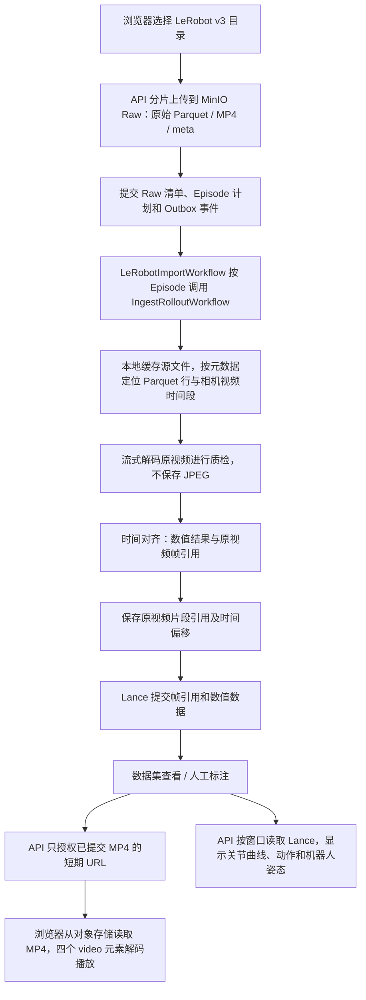

# LeRobot 原始上传与完整处理

单机部署见 [部署与迁移](single-server-storage.md)。原始视频、Parquet 与元数据始终保留。
当前 G1 LeRobot v3 上传默认选择“自动质检、对齐并进入标注”，配置数据集、采集任务、机器人与标签规则。
也可以选择仅存档，再从上传记录点击“开始质检与对齐”，无需重新上传。
处理完成后通过数据集和标注工作台同步查看多路视频、关节曲线、机器人姿态并完成标注及审核。

原生处理不生成全量 JPEG 或重复 H.264；质检按帧解码，视频仍引用原 MP4 的 episode 时间范围。
原始文件预览独立于质检结果，可用于问题数据诊断。命令行指定任务和机器人时进入处理模式，
不指定则仅存档。通用 LeRobot 和 ROS bag 的原始存档不等同于已支持所有机器人、消息类型的自动处理。

## 开发部署

`compose.dev.yaml` 默认使用真实 API 和本机 MinIO。浏览器上传文件正文经过平台 API；
API、Worker、Lance、视频与机器人模型资源保存在本机。无需 OSS 账号或云凭据。

```bash
docker compose -f compose.dev.yaml up --build -d
```

打开 <http://localhost:8088> 或 <http://localhost:5174>。如果此前显式开启 Mock，使用
`HC_FRONTEND_MOCK_MODE=off docker compose -f compose.dev.yaml up -d --force-recreate frontend`。
数据保存在 Docker named volumes；重建容器会保留数据，请勿使用 `down -v`。

## 页面操作

1. 登录并选择自己的项目。账号需具备上传、数据集读取、人工标注权限；发布规则、审核、
   发布版本分别需要相应权限。审核必须使用另一账号。
   登录时自动选择项目已有的数据区域；新项目默认 `global`。有多个区域时可在顶部
   “当前数据区域”切换。数据区域与 MinIO 的 S3 区域相互独立。
2. 准备数据集及关联的 **ACTIVE 采集任务**、当前项目中启用的机器人数据源。
   首次预览机器人姿态时，先在“机器人模型”上传并发布 G1 URDF 和全部相对路径 mesh 资源，
   在“机器人实例”绑定该模型版本。本次验证使用官方 `g1_29dof_mode_15_with_dex1_1.urdf`。
3. “数据上传”选择包含 `meta/info.json` 的 LeRobot **v3** 根目录。
   必须带齐 `meta/episodes/**/*.parquet`、数据 Parquet 和元数据引用的四路 MP4。
   选择目标数据集、采集任务和机器人；在确认窗口发布 G1 人工标注规则，然后确认上传。
4. 文件上传完成后，继续观察下方 **LeRobot 处理记录**，直到显示“处理完成，可人工标注”。
   Worker 按 Episode 执行校验、质检、30 Hz 对齐、Lance 写入和视频生成。
   失败记录支持重试，已完成的 Episode 会跳过。一次导入对应一个数据集；另一份不同目录使用新数据集。
5. “数据标注”打开自动生成的任务，点击“创建标注”。四路视频、29 个身体关节曲线和 G1 姿态
   共用时间轴。拖选区间或设置入点/出点，输入 Tag 名称并创建，保存修改后提交审核。
6. 另一账号在“Tag 审核”查看提交。未勾选问题时，提交审核即通过；有问题则标记后退回修改。
7. 回到“数据集 → 数据版本”，点击“手动发布版本”，填写版本名称并“发布并定版”。
   上传生成的是内部工作快照；这一步才生成正式数据集版本。

## 数据与预览说明

- 原始 Parquet、MP4、元数据保留相对路径；平台直接读取原生 Episode，不要求转成 MCAP。
- 当前原生处理配置针对 Unitree G1 v3 的 30 Hz 数据及四路相机。其他机器人或版本仍需适配。
- 相机视频需要支持 H.264 的浏览器。G1 的 29 个身体关节使用真实位置数据驱动。
  Dex1 手部控制值缺少到 URDF 关节的标定关系，手指几何可显示，但不把控制值冒充关节角。
- 没有绝对采集时间的 LeRobot 数据使用相对时间轴，不推算真实采集日期。
- MinIO 控制台为 <http://localhost:9001>，开发账号 `minio` / `minio-local-only`。
  浏览器媒体入口为 <http://127.0.0.1:9000>。当前配置用于在本机浏览器操作。
- 本机显式 MinIO 配置优先于数据库中旧的 OSS 设置。开发 Compose 的网页上传固定为代理模式，
  不会因为恢复旧上传记录而切回 OSS 直传。

## 当前 LeRobot 视频数据流

2026-09-20 核对当前代码及本地缓存的
`unitreerobotics/G1_WBT_Dex1_Put_Clothes_into_Washing_Machine`
（revision `6d698e2641cc4bb765cd738835fe3a4ecc0fe2c7`）：元数据声明 v3.0、154 个
Episode、30 Hz。本地四路 `file-000.mp4` 经 `ffprobe` 检查均为 **AV1、640×480、30 fps**。
这是源文件检查，不代表已读取正在部署的数据库或播放产物。



- **原始上传不转码。** Raw 保留相对路径和原始字节。上传与后台处理是两个阶段。
- **原生 LeRobot 不再重新编码视频。** 质检逐帧读取解码结果；对齐和可视化引用原 MP4。
  原视频引用使用独立的媒体配置，避免误认成历史 H.264 产物。衍生清理只拥有 JSON 索引。
- **播放与数值数据分路。** 四路媒体引用登记完成后，Lance 提交相机帧引用和数值数据。
  相机引用包含对象 key、帧号和时间戳；持久 Lance 不保存这批 JPEG 图像正文。
  数据集页和标注页通过 `aligned-media/authorize` 获取 MP4 地址，视频正文直接由
  MinIO 媒体入口提供；关节、动作等数据通过 API 按窗口读取 Lance。
- **打开页面不会创建转码任务。**
  [授权服务](../backend/src/hc_data_platform/aligned_media/service.py) 只查询已提交产物并签名；
  产物未完成则报未就绪，不会在播放请求内生成。浏览器播放仍需要正常的视频解码。
- **连续录制切分是另一条仍在使用的链路。** 它使用 `mp4_source`，根据源编码、时间基、
  时间范围等条件决定直接复制或转码。不能把这条链路的直接复制能力当成当前 LeRobot
  原生导入的行为，也不能将它视为废弃代码删除。

播放器采用主视频实际时间驱动共享时钟，缓冲与 seeking 时暂停校正；普通漂移采用小幅速度调整，
大幅漂移才跳转并设置冷却时间。数值窗口按需读取，关节曲线限制界面更新频率。

已清理无人调用的 `LeRobotEpisodeProcessor` 及其结果类型、媒体授权的旧生成状态回调，
以及只剩说明文件的 `hc_data_platform.preview` 包。旧 HLS 运行时已经退役；历史 SQL
迁移仍保留用于数据库校验和兼容，说明见[预览迁移记录](../backend/migrations/preview/README.md)。

## 既有流程验证记录（本次合并前）

使用仓库已缓存的 Unitree 官方洗衣机 G1 数据，取两个 Episode 各 90 帧（3 秒），
在隔离验收项目完成页面上传、四路视频同步定位、29 个身体关节与机器人显示、人工标注、
第二账号审核和手动发布。发布后的只读预览也逐个验证视频、动作、关节和位姿数值面板。
回归覆盖多个 Episode 的处理、超过 100 个 Episode 的预览分页，以及跨工作快照保留
未改变 Episode 的审核结果；内容发生变化时仍拒绝沿用旧审核。

这不是全量 154 Episode 的容量/性能测试，也不代表
[本地服务器验证里程碑](../plan/LOCAL-SERVER-VALIDATION-MILESTONE.md) 的所有格式、故障注入、
网络隔离和全量 CI 已完成。开发启动命令与脚本入口见 [README](../README.md)。
