# P01–P20 前端 E01–E10 效果图评审

> 状态：等待用户评审
>
> 生成日期：2026-08-17
>
> 生成方式：Codex 内置 `image_gen`
>
> 重要：效果图验证页面结构和交互方向，不代表真实 API、数据库、Worker、权限或生产安全能力已经实现。

## 1. 本轮结论

首批 10 张结构基准图已经生成并保存在 `design/effect-images/E01-E10/`。它们覆盖公网认证、共享 Shell、P01/P20 主链、摄取/QC、共享数据工作台、标注、清洗审核、账户授权以及容量/生命周期治理。

本轮没有修改前端或后端业务代码。

## 2. 图片评审

### E01｜认证与账户状态

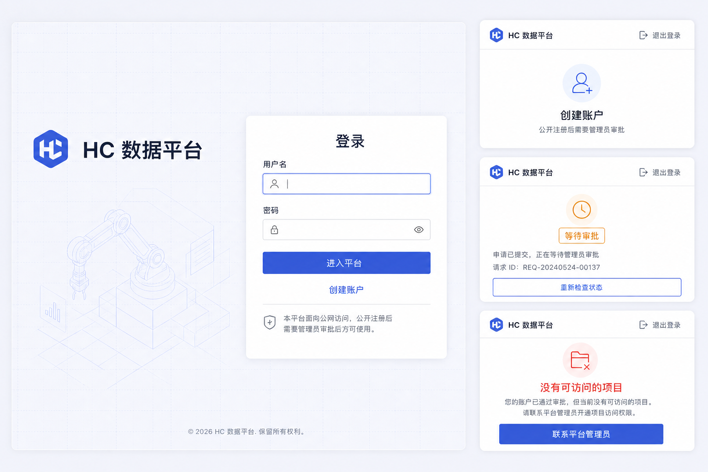

检查点：公开用户名注册、管理员审批、无项目状态；认证层不显示业务 Shell。

### E02｜全局 Shell

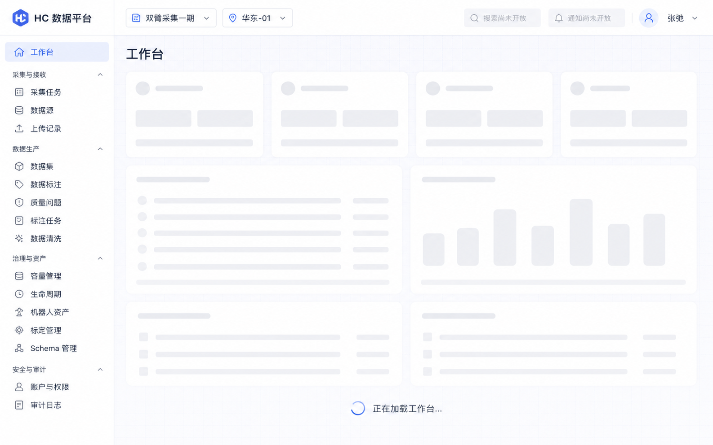

检查点：按功能分组导航；项目与区域分开；搜索和通知未开放时不伪装可用。

### E03｜P01 工作台

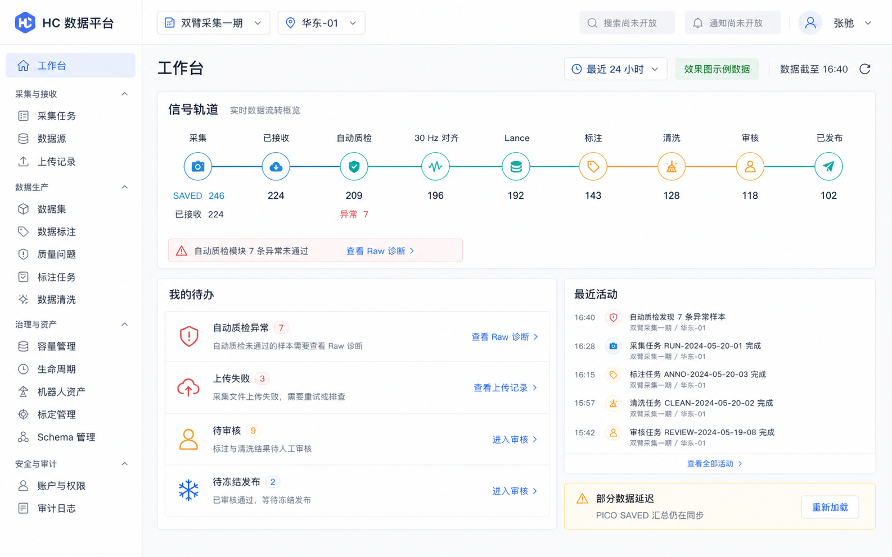

检查点：真实业务信号轨道；SAVED 与已接收分开；自动质检异常只进入 Raw 诊断；局部失败不清空整页。

已知待修正文案：`待冻结发布` 行的操作应为 `进入发布`，图中仍显示 `进入审核`。该项已经写入效果图合同，后续实现不得照抄错误文案。

### E04｜P20 采集任务

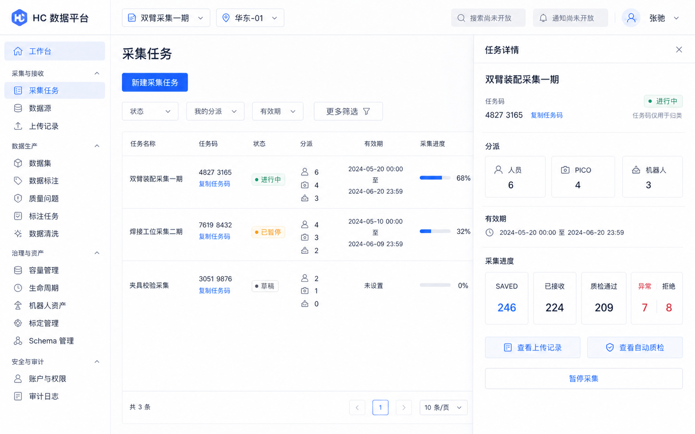

检查点：任务码只用于归类；人员/PICO/机器人独立分派；SAVED/已接收/QC 分开；上传执行跳转 P03。

### E05｜P04 摄取/QC 详情

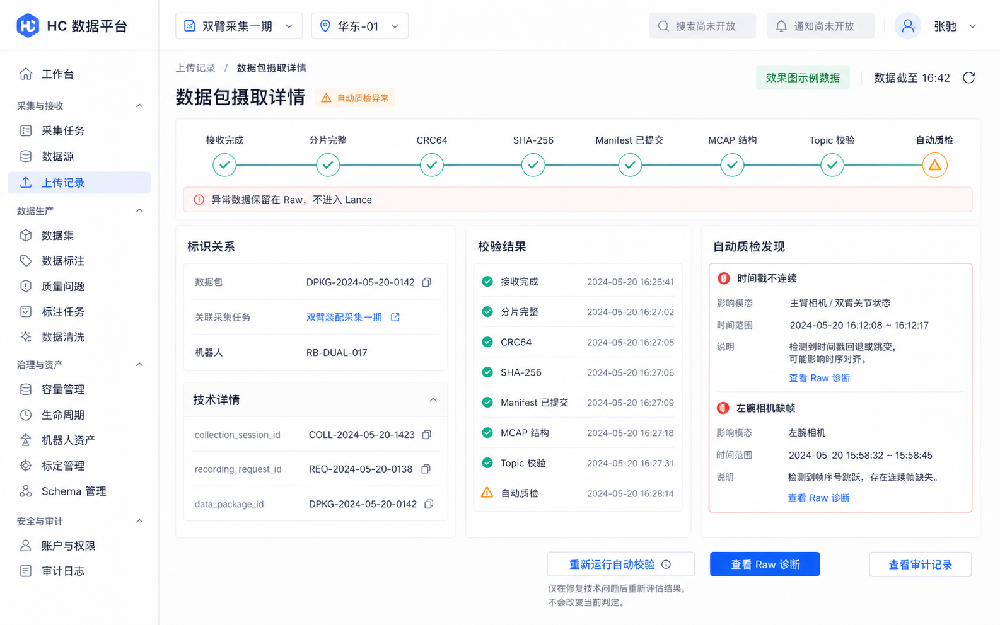

检查点：校验轨道、标识关系、自动质检发现；异常保留 Raw，不进入 Lance；没有人工放行。

### E06｜Raw 诊断工作台

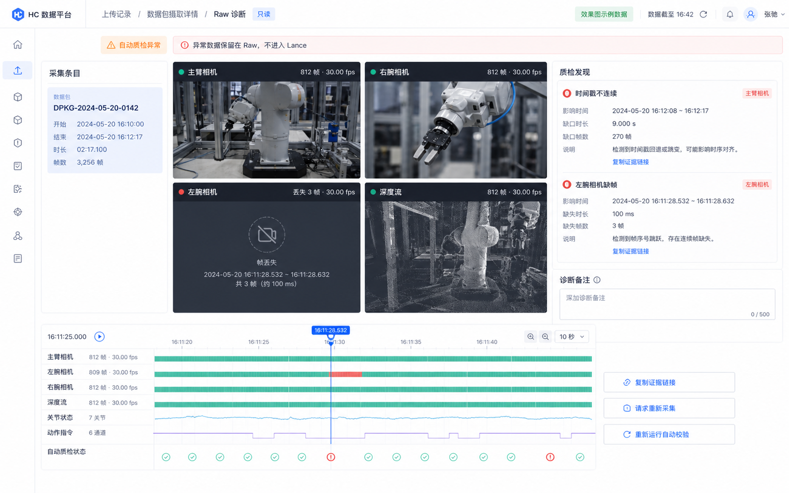

检查点：共享工作台 Raw 只读模式；相机、曲线、状态和异常共用时间轴；诊断备注不改变 QC。

### E07｜P08 标注工作台

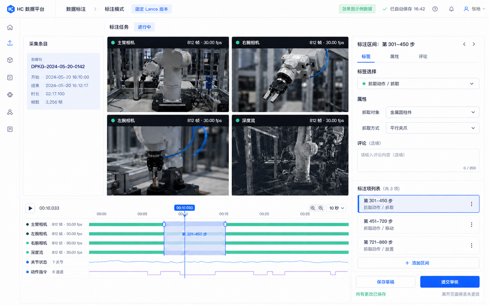

检查点：复用 E06 空间结构；固定 Lance；业务步区间；保存草稿与提交审核；无 Raw/发布入口。

### E08｜P11 清洗审核对比

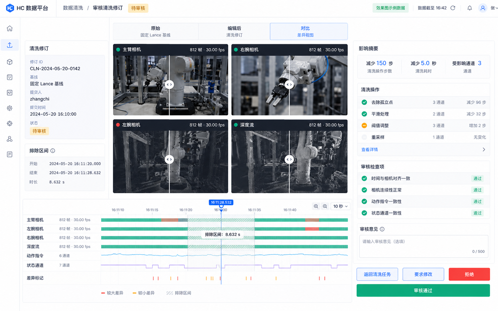

检查点：原始/编辑后/对比保持同构；“原始”是基线 Lance；排除区间非破坏；审核与发布分离。

### E09｜P18 账户与权限

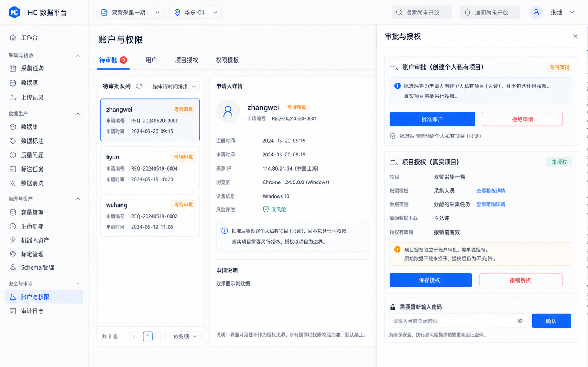

检查点：账户审批与真实项目授权分离；审批自动创建个人私有只读项目；权限模板 + 数据范围；近期密码再认证。

### E10｜P12/P13 容量与生命周期

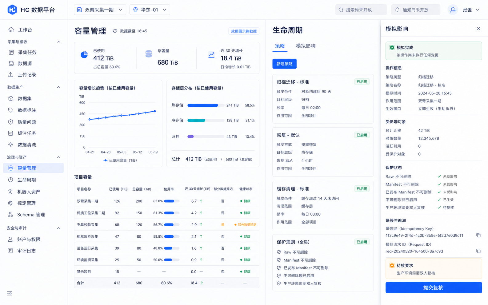

检查点：没有费用；容量/增长/存储层；Raw/Manifest 不可删除；生命周期先模拟影响，生产执行双人复核。

## 3. 统一验收结果

| 检查项 | 结果 |
|---|---|
| 同一紫蓝视觉系统和 Shell | 通过 |
| 页面按功能复用、不按角色复制 | 通过 |
| P08/P11/Raw 诊断共享工作台结构 | 通过 |
| QC 异常没有人工放行 | 通过 |
| 标注/清洗没有发布动作 | 通过 |
| P12 无费用，P13 无删除 | 通过 |
| P15 云端机器人控制 | 本批未画；后续 E2 继续执行禁令 |
| 公网账户审批和项目授权分离 | 通过 |
| 1280 工作台布局 | 视觉方向通过；仍需代码实现后的浏览器实测 |
| 文案完全准确 | 部分通过；E03 有 1 项已记录修正 |

## 4. 用户评审重点

请重点判断以下 5 点：

1. 紫蓝色、信息密度和左侧导航是否符合平台长期方向。
2. P01 的“信号轨道”是否比原 KPI/Mock 漏斗更适合。
3. E06–E08 的共享工作台是否满足“可视化页面承接全部可视化”的要求。
4. P18 是否正确表达公网账户审批与项目授权分离。
5. P12/P13 是否完全排除了费用和业务删除。

## 5. 用户确认后的 E2

E1 通过后继续生成：

- P02 数据源。
- P03 上传记录。
- P05 数据集。
- P06 采集条目。
- P07 版本审核与冻结发布。
- P09 质量问题。
- P10 标注任务。
- P14 机器人模型。
- P15 机器人实例/组件。
- P16 标定管理。
- P17 Schema/Manifest/Topic 注册表。
- P19 审计日志与安全事件详情。

随后再生成 E3 的空态、部分失败、无权限、会话过期、平板和手机状态图。

## 6. 评审回复格式

全部接受：

```text
E01–E10 整体方向通过，继续生成 E2。
```

局部修改：

```text
E03：……
E07：……
其余通过，修改后继续 E2。
```

## 7. 2026-08-17 用户逐项反馈与 V3 评审稿

本节是当前评审基线；第 2 节首版图片保留用于追踪修改历史。

| 图号 | 当前 V3 | 已落实的主要反馈 |
|---|---|---|
| E01 | 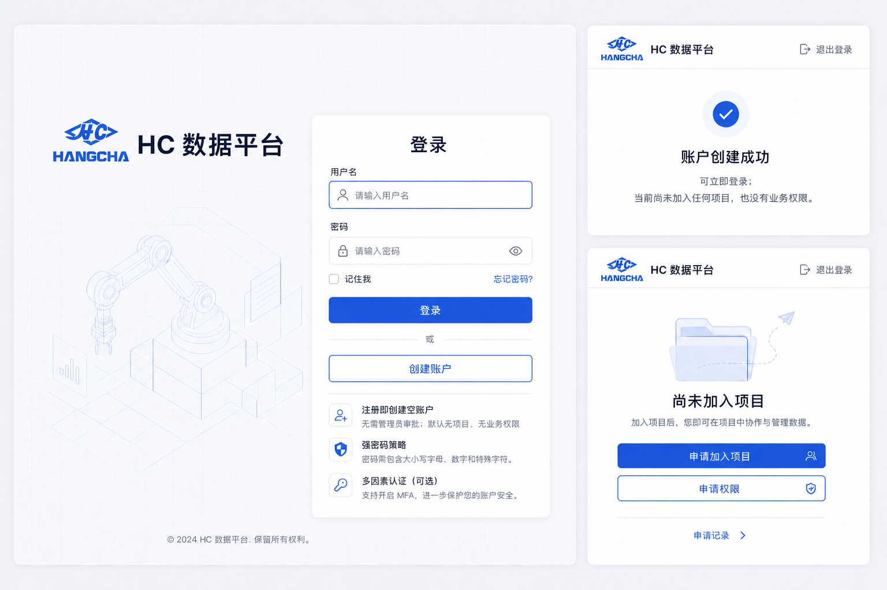 | 注册免审批、无邮箱/手机号验证、空账户、申请加入项目/权限、官方 Logo |
| E02 | 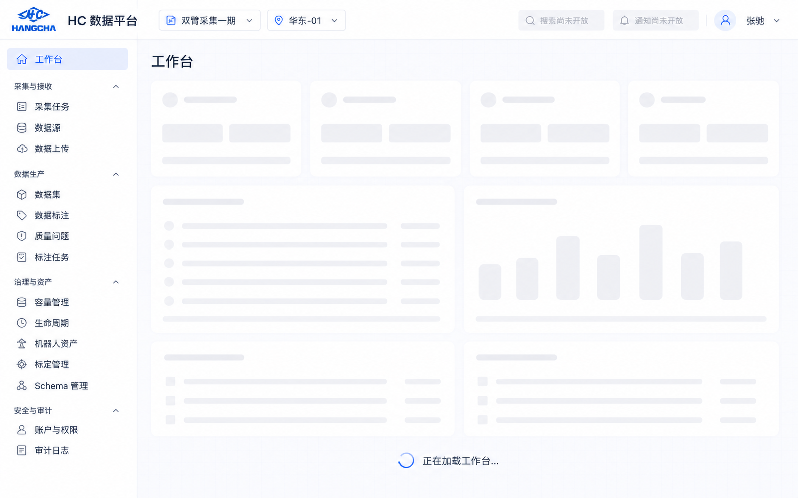 | 官方 Logo；导航使用数据上传/数据标注；无独立上传记录/数据清洗 |
| E03 | 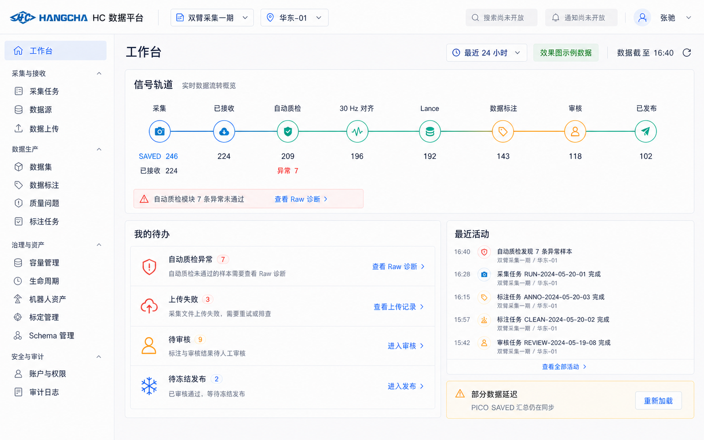 | 标注/清洗合并；信号轨道单一数据标注阶段；进入发布；官方 Logo |
| E04 | 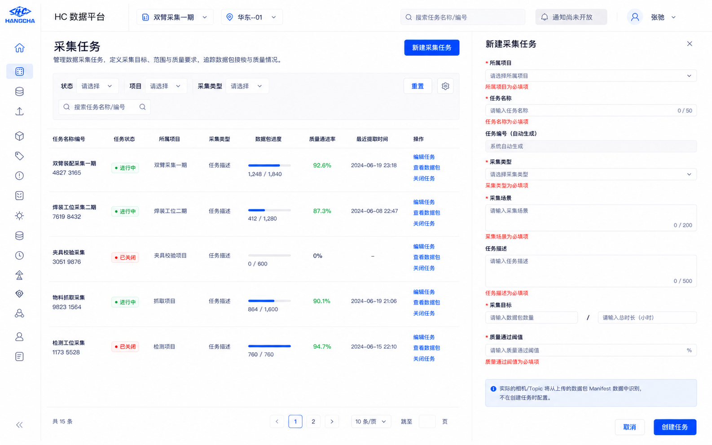 | 创建入口和同页抽屉；无分派、时间、暂停；任务描述替代模态/Topic；折叠功能导航 |
| E05 | 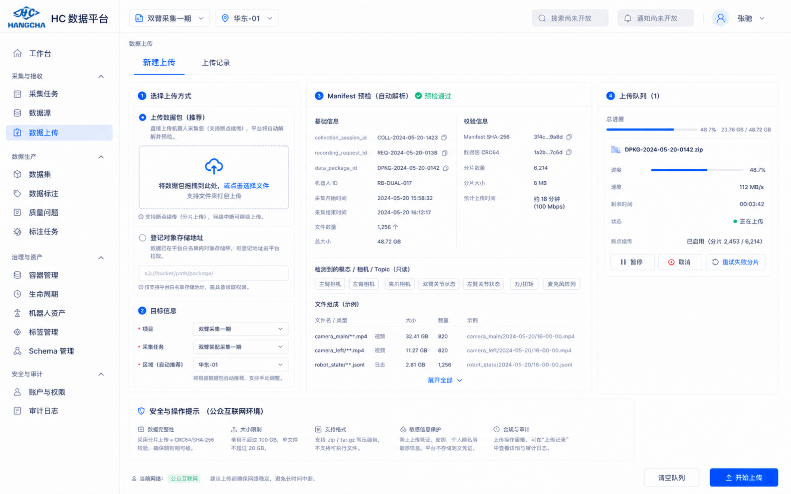 | 补充上传操作页；新建上传/上传记录复用；Manifest 预检；官方 Logo；导航收口 |
| E06 |  | Raw 诊断结构保留；官方 Logo |
| E07 | 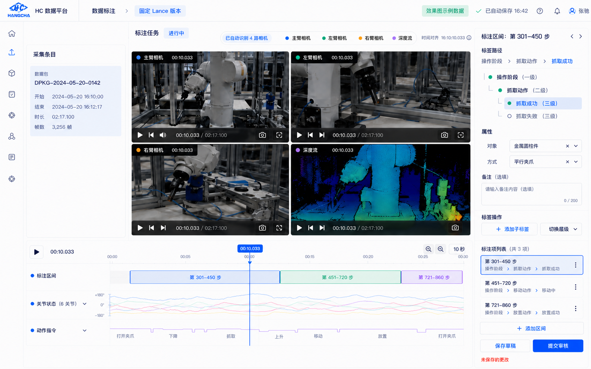 | 相机自动发现并同时显示；单时间轴；三级 Tag 与属性；官方 Logo |
| E08 | 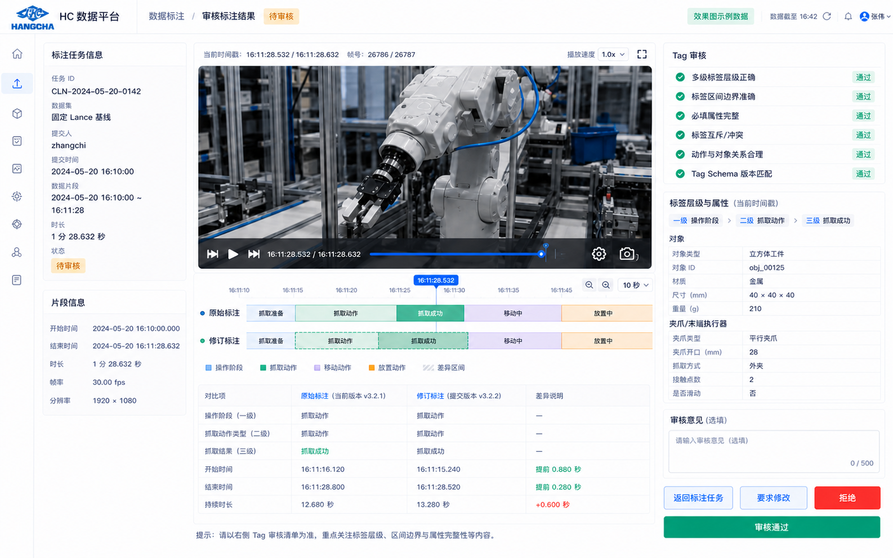 | 并入数据标注；审核重点改为 Tag 层级/边界/属性/冲突/Schema |
| E09 | 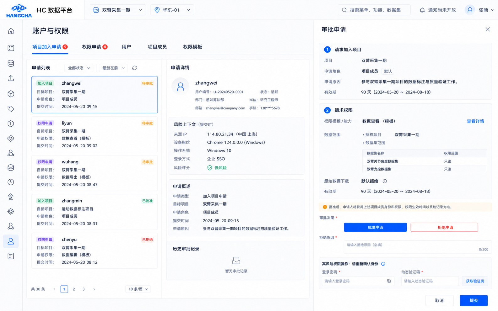 | 只审批项目加入与权限；无账户审批；官方 Logo；使用折叠功能导航避免重复页面概念 |
| E10 | 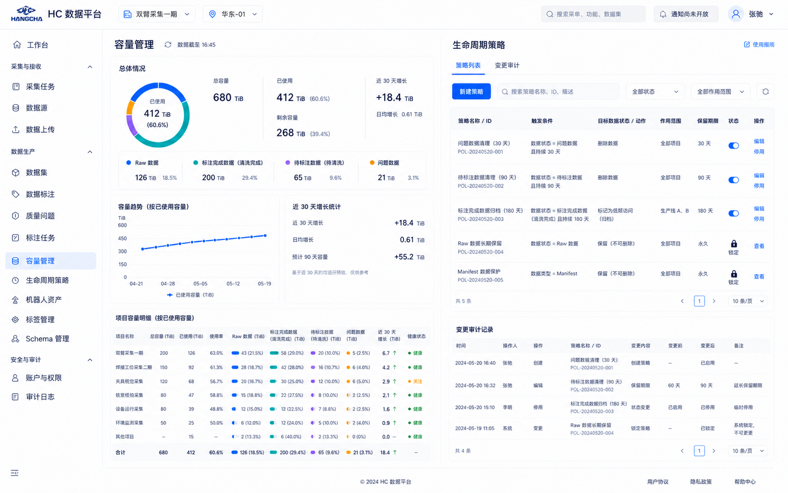 | 四类业务状态容量；无影响模拟；策略变更审计；官方 Logo；导航收口 |

V3 仍属于信息架构效果图，图片中的示例数字、ID、任务名和生成模型造成的局部文字不构成合同。最终可见规则以 `P01-P20-POST-EFFECT-REVIEW-IMPLEMENTATION-PLAN.md` 的 UXF-01～12 为准。
